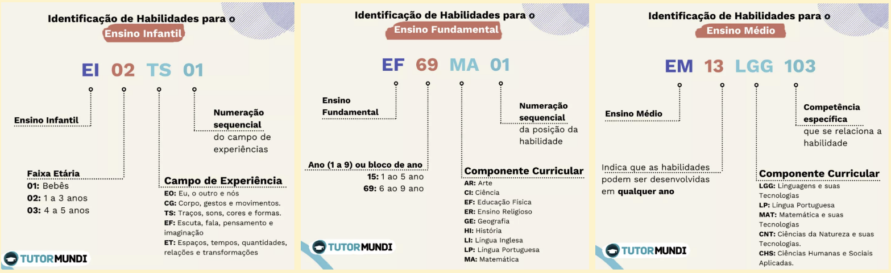

## Contexto

Segundo o IBGE, no Brasil, existem registradas **124.840 mil escolas de ensino fundamental** e **28.933 mil escolas do ensino médio**. Em termos de número de matrículas, isso representa **26.718.830 milhões matrículas para o ensino fundamental** e **7.550.753 milhões** para o ensino médio (https://cidades.ibge.gov.br/brasil/pesquisa/13/5908). Com o intuito de harmonizar a base curricular desse grande número escolas e estudantes, oferecendo assim um modelo de ensino de qualidade e que vise capacitar os alunos para as consecutivas fases da sua vida, o **Ministério da Educação** publicou, em 16 de setembro de 2015 a primeira versão da *Base Nacional Comum Curricular* (BNCC). Este documento normativo define o conjunto de aprendizagens que todos os alunos devem desenvolver ao longo da sua formação na Educação Básica. 

> A **BNCC** está estruturada em códigos alfanuméricos, que contemplam as competências a serem desenvolvidas em cada etapa da formação do aluno na Educação Básica. 

O código é dividido em quatro partes, como o exemplo **EF 09 AR 01**: 

1. O primeiro par de letras indica a qual etapa do ensino básico essa competência está inserida, neste caso, Ensino Fundamental. 
2. O primeiro par de números indica o ano ou bloco de anos em que esta competência está incluída, neste caso 9° ano. 
3. O segundo par de letras indica qual a qual área do conhecimento a competência pertence, AR = Artes e o segundo par de números mostra a posição da habilidade na numeração sequencial do ano ou bloco de anos referente à competência. 

As imagens abaixo apresentam outros exemplos da descrição dos códigos da BNCC.

A partir da homologação do relatório final da BNCC em 2018, pelo Ministério da Educação, as escolas devem alinhar seus currículos em consonância às diretrizes estabelecidas pela BNCC. E isso impacta em um replanejamento de estruturas curriculares, alinhamento da coordenação pedagógica, treinamento de professores para que apliquem de forma eficiente as normativas às suas aulas e avaliações, entre outras. 

Os conselhos de educação de cada estado, juntamente com as secretarias de educação, são responsáveis pela fiscalização da aplicação das normativas da BNCC em cada escola, sejam elas públicas ou privadas. 

## Problema de negócio

É percebido que apesar da obrigatoriedade de seguir a BNCC, as Escolas geralmente não têm o devido preparo e professores não são bem capacitados para relacionar os códigos às questões aplicadas em provas e simulados. Uma das razões para esses problemas supracitados é que além do documento da BNCC ser extenso, possui mais de mil códigos em sua totalidade, tornando todo processo de classificação moroso e ineficiente. 

Assim, vemos que *dois problemas de negócio emergem*. O primeiro está relacionado à própria escola do Ensino Básico, que, em função da necessidade de adequação curricular à BNCC, demanda uma ferramenta de acompanhamento das distintas disciplinas quanto ao cumprimento da base curricular reformulada, para que se cumpra a narrativa. Além disso, há a necessidade de treinamento de professores para a implementação das normativas da BNCC às disciplinas às quais são responsáveis, visto que, em sua formação acadêmica, as normativas da BNCC não foram contempladas. 

É sabido, ainda, que profissionais das Ciências da Natureza e Matemática apresentam dificuldade e resistência quanto à aplicação da BNCC em suas disciplinas, dado o caráter subjetivo de alguns códigos e habilidades, a falta de preparo em traduzir esses códigos em suas questões, durante a avaliação e a falta de experiência com esse tipo de abordagem curricular. 

Diante desse problema, **iremos trazer uma solução que auxiliará as escolas e suas divisões pedagógicas** quanto ao acompanhamento e cumprimento das normativas estabelecidas pela BNCC nas diferentes disciplinas e etapas dos ensinos fundamental e médio e **o profissional da educação** na adesão da BNCC no seu dia-a-dia, implementando uma aplicação que *irá classificar questões enviadas pelo usuário no formato texto, retornando para o mesmo os mais prováveis códigos correspondentes à BNCC* e aplicando as normativas de forma mais eficiente e, ainda, com um caráter social, permitir que profissionais de instituições públicas de ensino tenham acesso a esta tecnologia, de forma gratuita, sem que necessariamente haja investimento estatal ou necessidade de participação de licitações, contribuindo assim para a construção de um ensino básico de qualidade e acessível.

## Impacto

Acreditamos que o Projeto impactará duas áreas diferentes: o campo dos negócios e o pedagógico. No quesito de **negócios** presumimos à diminuição da necessidade de profissionais envolvidos no processo de classificação de questões, diminuindo assim o custo para empresas que pagam por esse serviço e possibilitando que esses profissionais possam atuar de forma mais eficiente em diferentes demandas, como na elaboração de questões para o banco de dados, por exemplo. No âmbito de **vantagem competitiva**, as empresas que incorporarem nossa tecnologia inovadora teriam um diferencial de mercado dentre outras EdTechs - startups focadas no desenvolvimento de soluções tecnológicas para a educação.

No campo **pedagógico**, a implementação do Classificador tornaria mais acessível e eficiente a aplicação da BNCC pelos profissionais da educação, possibilitando assim que os currículos escolares estejam melhor alinhados à normativa do MEC. Desse modo, alcançaremos o principal objetivo do Projeto, no qual teremos um ensino mais direcionado e eficiente, impactando diretamente e de forma positiva o aprendizado estudantil.
