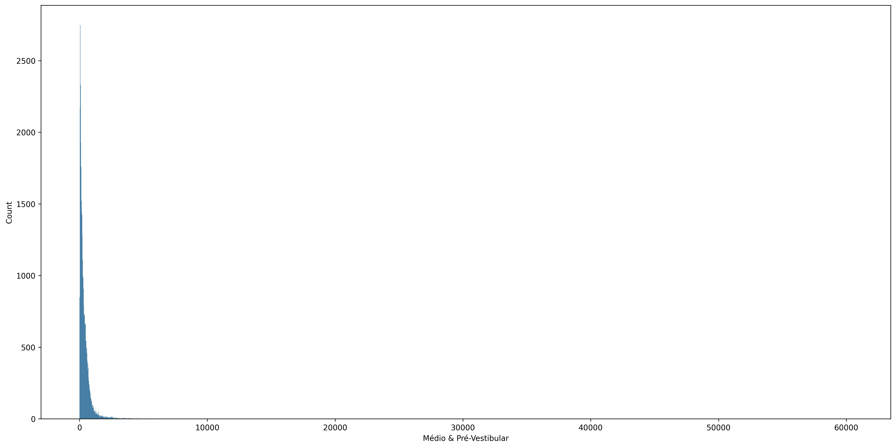
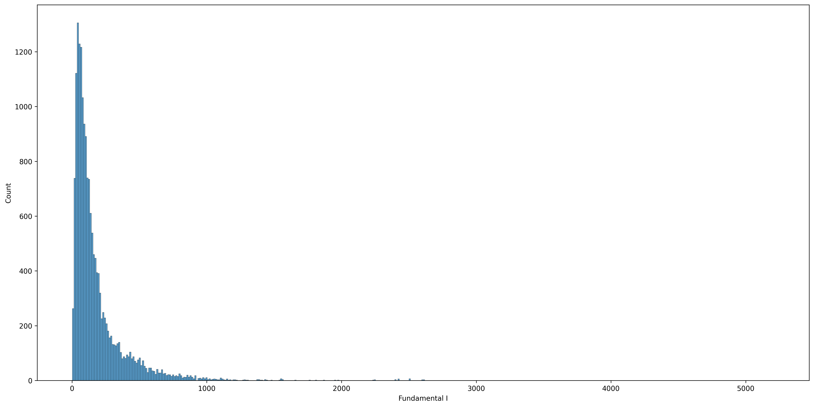
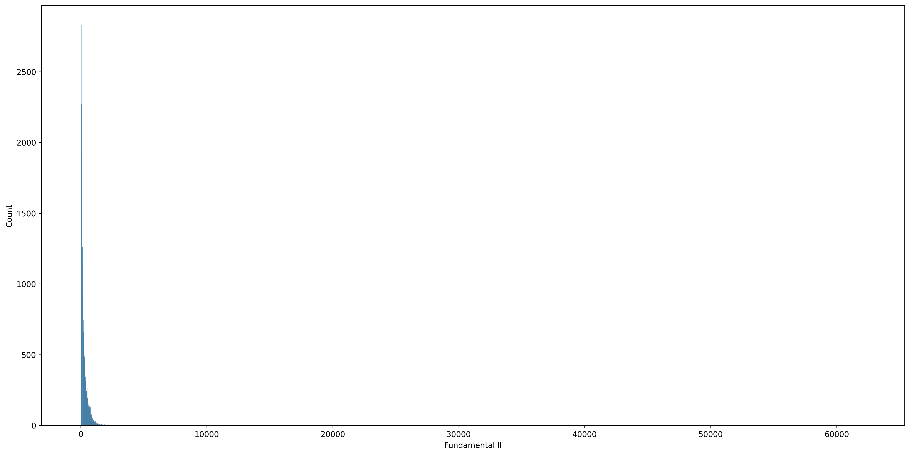
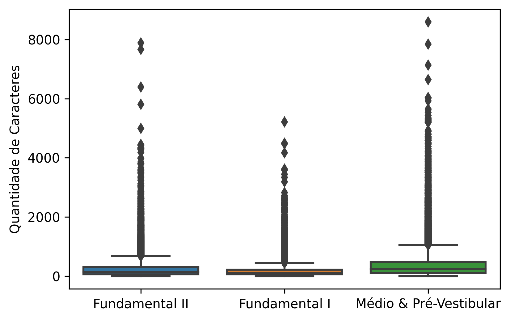
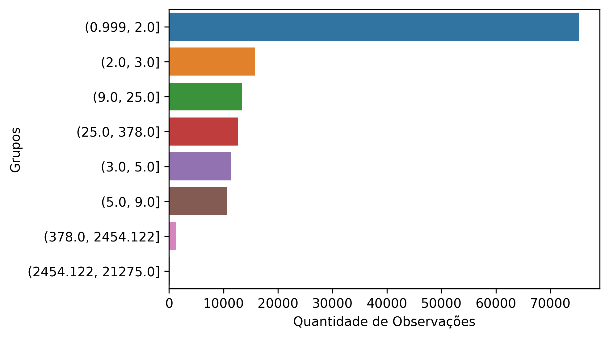

# Análise Exploratória de Dados

Como foi explicado nos tópicos anteriores, iremos construir 4 diferentes classificadores e ambos terão sua análise exploratória dos dados, pois precisarão de uma nova coleta.

Nesse primeiro momento, nós estamos focados na criação do primeiro classificador, que vai buscar classificar se a questão é Ensino Fundamental I e II (EFI e EFII) ou Ensino Médio (EM).

## Target

Sendo assim, foram coletados 100k de observações onde seguem a seguinte distribuição:

| Etapas de Ensino                | Quantidade de Observações |
| --------------------------------- | ----------------------------- |
| Médio e Pré-Vestibular        | 35.676                      |
| Fundamental I                   | 33.790                      |
| Fundamental II                  | 18379                       |
| Outras (Concurso, Militar, OAB) | 12.155                      |

Aqui já foi identificado que precisaremos dropar algumas observações que não são úteis para nosso problema, que seriam as classes: Concurso, Militar e OAB.

## Drop de Colunas

O dataset também trouxe dados sobre o Componente Curricular, porém, como estamos tratando de uma cadeia de classificadores, essa é uma informação que a princípio o modelo não teria, e consequentemente não teria acesso também aos assuntos. Sendo assim, optamos por dropar essas colunas e permanecendo apenas com:

| Colunas     | type  | Representação         |
| ------------- | ------- | ------------------------- |
| id          | *int* | id da questão no banco |
| question    | *str* | texto da questão       |
| bulletType  | *int* | tipo da questão        |
| scholar_lvl | *str* | nível escolar          |

## BulletType

Essa variável trás 7 tipos de questões:

1. Somatória
2. Múltipla Escolha
3. Certo e Errado
4. Discursiva
5. Redação ou items que é necessário enviar foto da resolução
6. Questões com mais de uma alternativa certa
7. Não representa nada em específico

Dessa forma, entendemos que drop os tipos 5, 6 e 7 faria sentido:

- Redação não está envolvida no componente curricular de Linguagens e sua Tecnologias
- Tipo 6 possui muito poucas observações.
- Ao observar o conteúdo da questões tipo 7, não existe uma ordem no formato dessas questões, por isso, iremos dropar também.

E a distribuição da variável `BulletType` ficou assim:

| Tipo da Questão | Quantidade de Observações |
| ------------------ | ----------------------------- |
| 1                | 2.968                       |
| 2                | 68.604                      |
| 3                | 1.179                       |
| 4                | 13.881                      |
| 5                | 999                         |
| 6                | 5                           |
| 7                | 209                         |

Onde temos muito mais **questões do tipo múltipla-escolha**, provavelmente por ser a mais utilizada em simulados tipo Enem.

## Question

Sendo assim, nos resta analisar a variável principal do dataset (`question`). Apesar de ter uma série de análises que seria interessante realizar, observamos que maior parte delas necessitaria quer o texto estivesse o mais limpo possível.

O texto das questões são exibidos no formato web, então temos uma quantidade bem grande de **tags html** para remover. Esse se tornou nosso primeiro step do data cleaning. Seguimos com uma remoção de números, pois existem muitos números indicando alternativas das questões, assim que em questões somatórias existe o valor de cada item (00, 11, 22 ...).

Realizar uma contagem dos números em cada questão pode ser uma boa variável quando estivermos classificando o **Componente Curricular**.

Após isso, seguimos as seguintes etapas:

- Remoção de pontuação
- lowercase das palavras
- remoção de stopwords padrões baseada na lib NLTK.

## Tamanho das Sentenças

Investigamos o tamanho das sentenças no dataset, na busca de identificação de algum padrão. Vimos que maior parte dos valores estão tendendo a 1, evidenciando uma distribuição com assimetria positiva. Veja os histogramas:

Aqui apenas o Fundamental I possui uma *distribuição um pouco mais dispersa* e com *valores extremos menores* que as outras duas classes.

O valor mínimo das sentenças foi de 1 e o máximo foi de 62.275 mil caracteres. Sendo um valor bem extremo de caracteres e que acontece pouquíssimas vezes, decidimos remover esses registros e observar os boxplots das classes de `school_step`.

Veja que aparentemente, sem os outliers extremos, questões do tipo Médio e Pré-Vestibular possuem maior quantidade de caracteres na mediana, seguido do Fundamental II e por fim o Fundamental I.

O contrário dos valores extremos nas questões também chamou a atenção, pois questões que possuem apenas 1 caracter provavelmente está com alguma inconsistência. Em uma análise futura iremos investigar qual o tamanho mínimo de caracteres que se torna significativo para exercer um trabalho de classificação neste dataset.

Para auxiliar nessa próxima etapa, avaliamos a quantidade de observações existentes em cada intervalo do tamanho dos caracteres. Os intervalos podem ser visto no eixo vertical do gráfico abaixo.

Esse plot nos mostra que possivelmente teremos um problema de quantidade de dados disponíveis caso optarmos por remover questões com tamanho de 1 a 9, pois maior parte do dataset possui observações com tamanho de 1 a 9.
