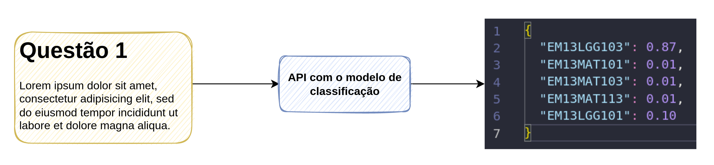
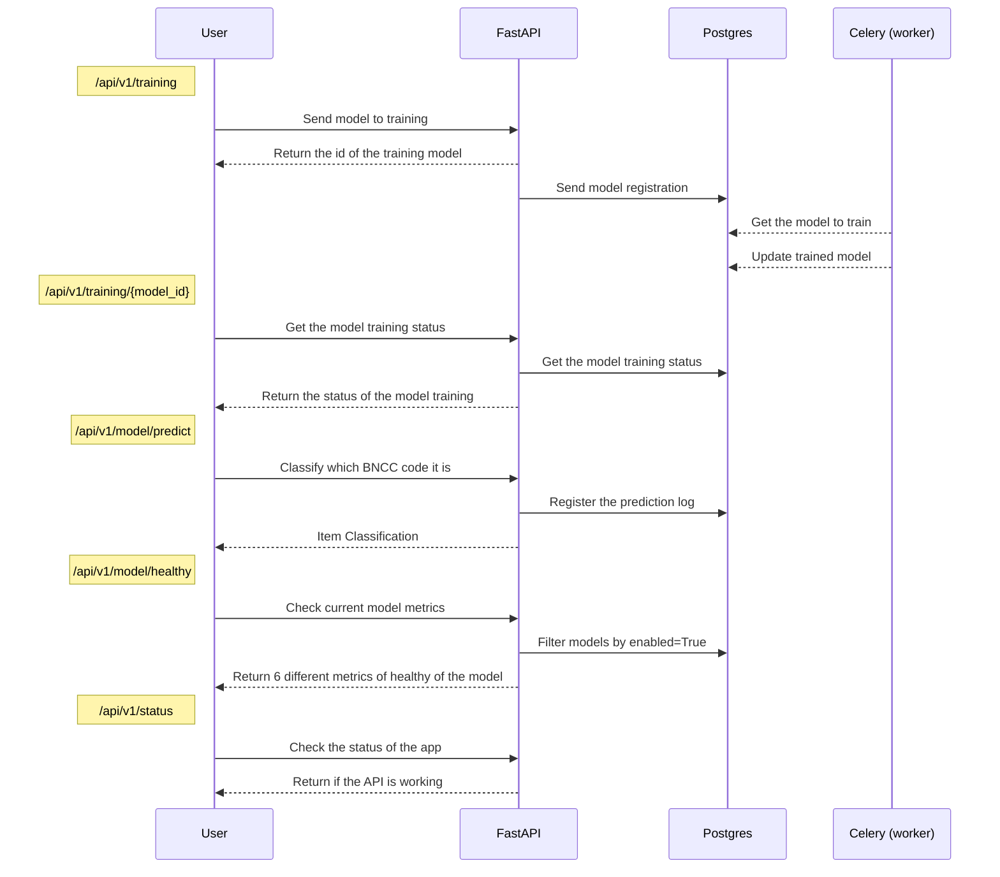
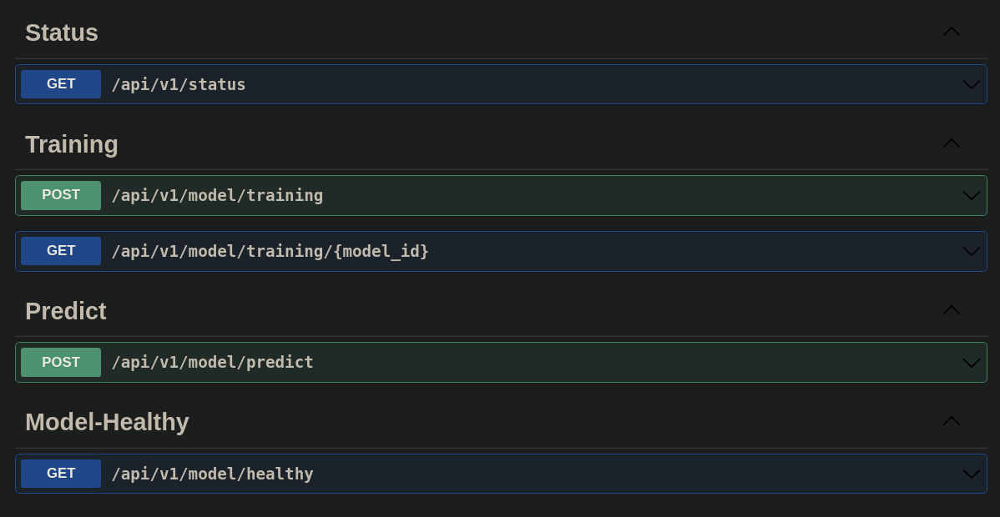
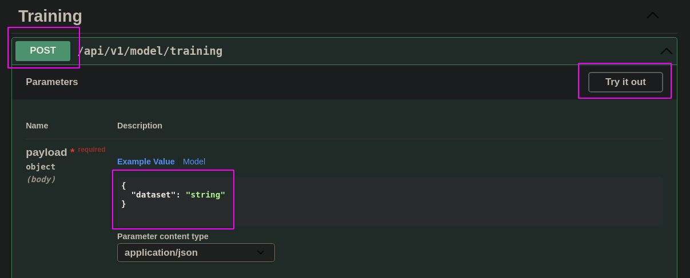

# API

A ideia inicial do projeto é ter como principal entregável uma API que consiga realizar a classificação dos items enviados de acordo com os códigos da BNCC (explicado com maior detalhes na etapa de [Estrutura do Projeto](https://lucianobatista.github.io/bncc-classifier/estrutura-do-projeto/)).

O **principal fluxo** de funcionamento da API consiste no esquema abaixo:

Lembrando que, o nosso modelo de classificação é na verdade um ensemble de 4 outros modelos, que irão ser construídos para entregar o código final da BNCC, apresentado acima.

A partir das etapas de experimentação, estamos produtizando o código e levando nossas etapas de pré-processamento e modelagem para dentro da API.

Para melhor entendimento do nosso produto, prefirimos dividir a informação em 4 etapas:

- Stack técnica: quais ferramentas irão ser utilizadas na construção da API?
- Infraestrutura: como os dados irão trafegar através dos nossos serviços?
- Como utilizar o Swagger?

## Stack

Inicialmente estamos estabelecendo algumas ferramentas que irão nos auxiliar na construção da API, abaixo estamos fornecendo uma breve descrição das principais utilizadas:

- **FastAPI**: um framework em python que auxilia na criação de diferentes tipos de APIs.
- **Celery**: também desenvolvido em python, e nos permite adicionar um sistema de filas de forma simples e direta.
- **Postgres**: banco de dados relacional, para mantermos os registros de interação com a API.
- **Docker**: generenciamento de todos os serviços através de containers.

## Infraestrutura

O esquema apresentado abaixo visa descrever o fluxo da informação dentre as diferentes camada da aplicação, promovendo um entendimento de como cada rota da API irá funcionar. A descrição de cada rota pode ser encontrada no tópico seguinte.

## Como utilizar?

Nossa API, a princípio conta apenas com o Swagger de interface gráfica. Essa interface de utilização é bem simples, com principal objetivo de interação crua com a API, e não visa ser uma versão para qualquer tipo de usuário. No entanto, entendemos que a mesma já está entregando bastante valor, pois conseguimos rapidamente _interagir com o produto_ e o _observar o impacto das mudanças realizadas no código_.

Ainda não realizamos o deploy dessa aplicação, e por enquanto a mesma está disponível apenas em ambiente local, porém, a tela do Swagger pode ser vista na imagem abaixo. Onde é possível interagir com todas as rotas disponíveis na API de forma bastante intuitiva.

Para utilização do Swagger, basta seguir as instruções:

### Rotas

- **Status**: Essa rota é um GET, e nos retornará o status do serviço da API.
- **Training**: Essa rota é um POST, onde será enviado dados para API, possibilitando o retreino do modelo, e adoção em produção do modelo que performar melhor.
- **Predict**: Essa é a rota é um POST e será utilizada para classificação do item de acordo a BNCC, portanto, precisa receber como dado, o item.
- **Model Healthy**: Com o modelo em produção, pode ser interessante saber quais são as métricas do modelo atual rodando na API. Para isso, essa rota será um GET que vai retornar o quão bem o modelo vai estar performando.
